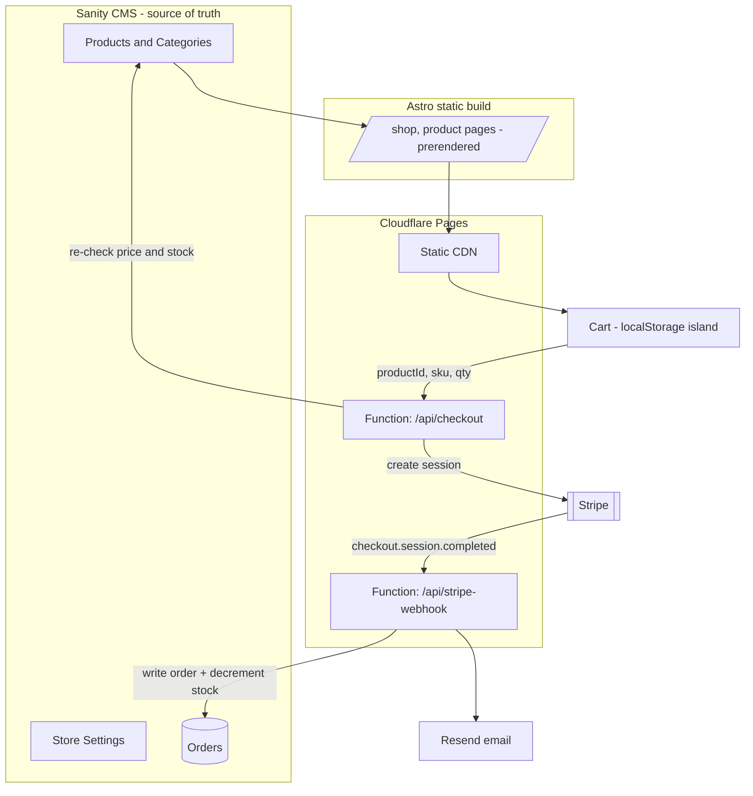
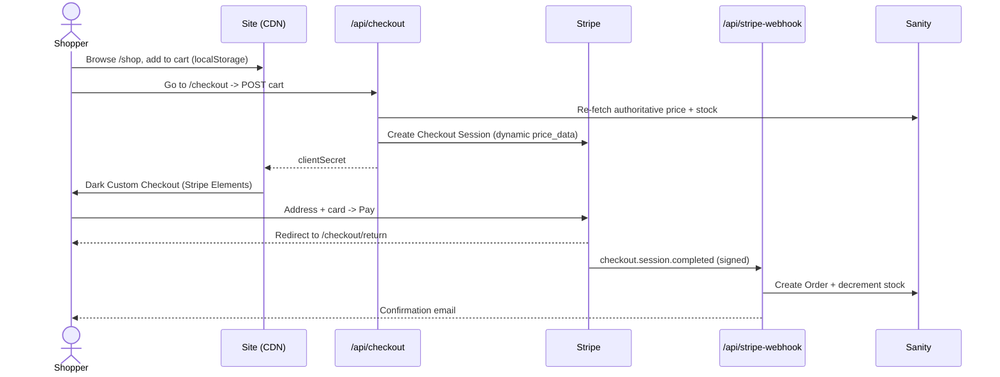

# E-commerce architecture & features

> Migrated from GitHub issue [#7](https://github.com/anthonycoffey/wakethenile.com/issues/7).
> Living documentation.

Hand-rolled store on the existing **Astro (static) + Sanity + Cloudflare Pages** stack. **Stripe**
for payments — **no Shopify**. Products are managed entirely in Sanity; the client never touches
Stripe.

## Why this instead of Shopify

- **One system** — merch is just another Sanity doc type next to Music/Shows/Videos. No second
  admin, no product syncing.
- **Pay only when you sell** — Stripe has no monthly fee vs Shopify's standing bill.
- **Pixel-perfect brand** — fully custom, dark/gold storefront *and* checkout (Stripe Custom
  Checkout + Appearance API), not a bolt-on iframe.

See [ADR 0002](../specs/adrs/0002-handrolled-stripe-store-no-shopify.md) for the decision record.

## Architecture

## The purchase flow

## Feature breakdown (by phase)

| Phase | Feature | Status |
|---|---|---|
| 1 | **Catalog** — `/shop` grid, product pages, category filters + pagination, custom taxonomies | ✅ |
| 2 | **Cart** — localStorage island, slide-out drawer, `/cart` page, header badge | ✅ |
| 3 | **Checkout** — Cloudflare adapter-free **Pages Functions**; **Custom Checkout** (Stripe Elements) styled dark; dynamic pricing, shipping, tax, promo codes | ✅ |
| 4 | **Fulfillment** — Stripe webhook → **Order** in Sanity, **stock auto-decrement**, confirmation emails | ✅ (needs webhook config #4) |
| 5 | **Automations** — self-hosted event bus / "our own webhooks" (purchase alerts, low-stock emails, registrable outbound webhooks) | ⬜ |
| 6 | **Polish** — live Stripe Tax, discount-code UI, etc. | ⬜ |

## Key implementation notes

- **Edge-native functions:** `functions/api/*` use **raw `fetch`** to the Stripe REST API and the
  Sanity HTTP API (no SDKs) — so they need no `nodejs_compat` flag, no adapter, and the site stays a
  plain static build. (The `@astrojs/cloudflare` adapter's build kept failing on CF; this sidesteps
  it.) See [ADR 0001](../specs/adrs/0001-edge-native-pages-functions.md).
- **Server-side price/stock validation:** `/api/checkout` never trusts client prices — it re-fetches
  from Sanity and rejects out-of-stock/inactive items.
- **Idempotent fulfillment:** the order uses a deterministic `_id` from the Stripe session, so
  webhook retries never double-count stock.
- **Sanity is the sole source of truth** — prices go to Stripe dynamically via `price_data`; no
  mirrored Stripe catalog.

## Data model (Sanity)

- `product` — title, slug, images, description, price, `variants[]` (label, sku, **price**,
  **stock**), `category` (ref), `tags`, `active`, `taxCode`, `soldOut`
- `productCategory` — taxonomy for `/shop` filters
- `order` — created by the webhook: line items, totals, shipping address, fulfillment status, Stripe
  ids
- `commerceSettings` — currency, shipping rates, tax toggle, low-stock threshold, from-email, admin
  emails

## Related

- Stripe order webhook setup: issue [#4](https://github.com/anthonycoffey/wakethenile.com/issues/4)
- Deploy webhook: issue [#5](https://github.com/anthonycoffey/wakethenile.com/issues/5)
- Internal event bus (post-launch): issue [#10](https://github.com/anthonycoffey/wakethenile.com/issues/10)
- Order emails (Resend config): issue [#11](https://github.com/anthonycoffey/wakethenile.com/issues/11)
